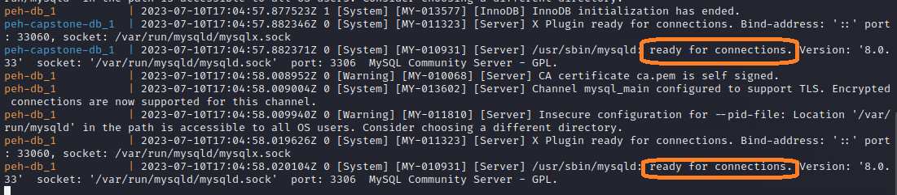

# Find & Exploit Common Web Vulnerabilities

1. [Installation](#installation)
2. [SQL Injection](#sql-injection)
3. [Cross-Site Scripting (XSS)](#cross-site-scripting-xss)
4. [Command Injection](#command-injection)
5. [Insecure File Upload](#insecure-file-upload)
6. [Broken Access Control](#broken-access-control)
7. [XML External Entities (XXE)](#xml-external-entities-xxe)
8. [Capstone](#capstone)


> [!NOTE] Database-specific syntax
> After finding the injection point it is recommended to try to specify the database type which you are attacking. This way you will know what syntax and characters for commenting to use.

> [!TIP] Additional resources
> [[https://appsecexplained.gitbook.io/appsecexplained/]]

## Installation

```shell
# install Docker and docker compose first

tar -xf peh-web-labs.tar.gz

cd labs

sudo docker-compose up
```

(Keep reading! There is one more thing to do after the lab is built!)

The first time it runs, it will need to download some things, it may take a while depending on your connection. Next time you run it though, it will be much faster.

Once you see the databses are 'ready for connections' the containers should be ready to go.


The final step is to set some permissions for the webserver, this is needed for the file upload labs and the capstone challenge.

`./set-permissions.sh`

Browse to `http://localhost`

The first time you load the lab the database will need to be initialized, just follow the instructions in the red box by clicking the link, then coming back to the homepage.

## SQL Injection

* When an application is vulnerable to SQL injection, and the results of the query are returned within the application's responses, you can use the `UNION` keyword to retrieve data from other tables within the database. This is commonly known as a SQL injection UNION attack.
``` sql
' UNION SELECT NULL,NULL,NULL--
```
* A SQL injection UNION attack enables you to retrieve the results from an injected query. The interesting data that you want to retrieve is normally in string form. This means you need to find one or more columns in the original query results whose data type is, or is compatible with, string data.
``` sql
' UNION SELECT 'a',NULL,NULL,NULL--
```
* Try scanning for SQL Injection in cookie headers
``` bash
sqlmap -r req.txt --level=2
```
* SQLi Defenses:

  * Parameterized statements
  * Sanitizing input

> [!TIP] Cheatsheet
> [[https://portswigger.net/web-security/sql-injection/cheat-sheet]]

## Cross-Site Scripting (XSS)

* There are three main types of XSS attacks. These are:

  * [Reflected XSS](https://portswigger.net/web-security/cross-site-scripting#reflected-cross-site-scripting), where the malicious script comes from the current HTTP request.
  * [Stored XSS](https://portswigger.net/web-security/cross-site-scripting#stored-cross-site-scripting), where the malicious script comes from the website's database.
  * [DOM-based XSS](https://portswigger.net/web-security/cross-site-scripting#dom-based-cross-site-scripting), where the vulnerability exists in client-side code rather than server-side code.

* An example of a simple payload for reflected XSS is ``````; this can be inserted as input or as query in URL.
* You can use the `fetch()` function with a free online webhook to extract data
``` html

```

* XSS defenses:

  * Encoding
  * Filtering
  * Validating
  * Sanitization
  
> [!TIP] Cheatsheet
> [[https://portswigger.net/web-security/cross-site-scripting/cheat-sheet]]


## Command Injection

* OS command injection is also known as shell injection. It allows an attacker to execute operating system (OS) commands on the server that is running an application, and typically fully compromise the application and its data.

|Purpose of command|Linux|Windows|
|---|---|---|
|Name of current user|`whoami`|`whoami`|
|Operating system|`uname -a`|`ver`|
|Network configuration|`ifconfig`|`ipconfig /all`|
|Network connections|`netstat -an`|`netstat -an`|
|Running processes|`ps -ef`|`tasklist`|

* Many instances of OS command injection are blind vulnerabilities. This means that the application does not return the output from the command within its HTTP response. Blind vulnerabilities can still be exploited, but different techniques are required.
``` bash
& ping -c 10 127.0.0.1 &
```

* Ways of injecting OS commands: a number of characters function as command separators, allowing commands to be chained together. The following command separators work on both Windows and Unix-based systems:
  - `&`
  - `&&`
  - `|`
  - `||`

- Prevent OS command injection attacks
  - Validating against a whitelist of permitted values.
  - Validating that the input is a number.
  - Validating that the input contains only alphanumeric characters, no other syntax or whitespace. 
## Insecure File Upload

- File upload vulnerabilities are when a web server allows users to upload files to its filesystem without sufficiently validating things like their name, type, contents, or size. Failing to properly enforce restrictions on these could mean that even a basic image upload function can be used to upload arbitrary and potentially dangerous files instead. This could even include server-side script files that enable remote code execution.

- Common file upload flaws:
  - Client-side verification only
  - Insufficient blacklisting of dangerous file like `.php5`, `.shtml` etc.
  - Obfuscating file extensions like `exploit.php.`, `exploit.php.jpg`, `exploit.php%00.jpg` etc.
  - Flawed validation of the file's contents. Exploiting it by using magic bytes: for example, JPEG files always begin with the bytes `FF D8 FF`.
  - Overriding the server configuration using `.htaccess`


- Prevent file upload vulnerabilities

  - Check the file extension against a whitelist of permitted extensions rather than a blacklist of prohibited ones. It's much easier to guess which extensions you might want to allow than it is to guess which ones an attacker might try to upload.
  - Make sure the filename doesn't contain any substrings that may be interpreted as a directory or a traversal sequence (`../`).
  - Rename uploaded files to avoid collisions that may cause existing files to be overwritten.
  - Do not upload files to the server's permanent filesystem until they have been fully validated.
  - As much as possible, use an established framework for preprocessing file uploads rather than attempting to write your own validation mechanisms.
## Broken Access Control

* Due to lack of automated detection and absence of access control; detected usually with the help of manual means.

- Common vulnerabilities include bypassing access control checks, viewing other users' records, privilege escalation and metadata manipulation.
  - Insecure direct object references (IDOR) are a type of [access control](https://portswigger.net/web-security/access-control) vulnerability that arises when an application uses user-supplied input to access objects directly. 
``` url
https://insecure-website.com/customer_account?customer_number=132355
```
  - Bruteforcing login portals
  - Access control vulnerabilities in multi-step processes like **MFA**

* Broken access control defenses:

  * Deny by default, except for public resources
  * Disable web server directory listing
  * Implement access control mechanisms
## XML External Entities (XXE)

- XXE abuses systems that pass XML input, attacks include 
  - DoS
  - local file disclosure
  - RCE

* Safe XML
``` xml
<?xml version="1.0" encoding="UTF-8"?>
<creds>
    <user>testuser</user>
    <password>testpass</password>
</creds> 
```
* Unsafe XML, XXE is carried out by exploiting the SYSTEM parameter.
``` xml
<?xml version="1.0" encoding="UTF-8"?>
<!DOCTYPE creds [
<!ELEMENT creds ANY >
<!ENTITY xxe SYSTEM "file:///etc/passwd" >]>
<creds><user>&xxe;</user><password>pass</password></creds>
```

* Virtually all XXE vulnerabilities arise because the application's XML parsing library supports potentially dangerous XML features that the application does not need or intend to use. The easiest and most effective way to prevent XXE attacks is to disable those features. Generally, it is sufficient to disable resolution of external entities and disable support for `XInclude`.
## Capstone

* Your objective is find as much vulnerabilities as you can in the web application

- Tools I recommend:
  - Ffuf or dirb
  - SQLMap
  - Burp Suite Professional

* It is recommended to first start a web content discovery in the background. Furthermore, if you have Burp Suite Professional you can start a few active scans for suspicious requests.

- Issues:
  - Stored XSS in the comment section
  - Reflected XSS after logging in the "welcome" message
  - SQL Injection in coffee ids
  - Hidden, but publicly available admin panel found by content discovery
  - Insecure File upload which results RCE using magic bytes and webshell or reverse shell