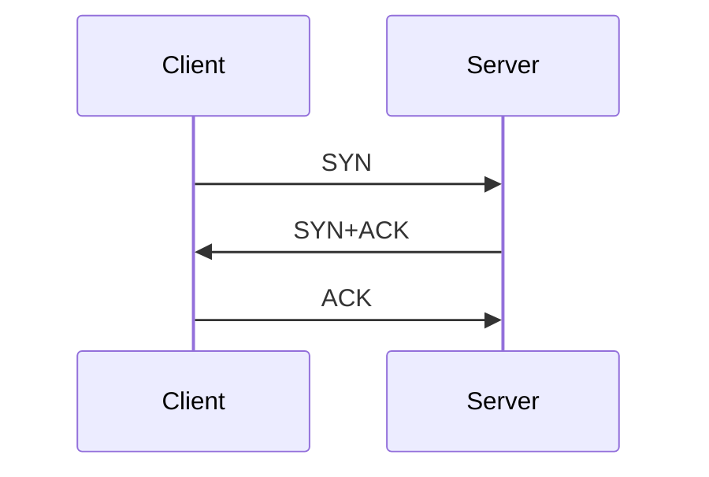

# Networking Basics

* The IP address and MAC address of the device can be viewed using ```ifconfig```.

* IP address - Layer 3; MAC address - Layer 2.

* The first three pairs in a MAC address act as identifiers, can be used in lookup to identify the vendor.

* In layer 4, TCP (connection-oriented) and UDP (connection-less) would be used as protocols.

* TCP three-way handshake - SYN packet is sent first, then SYN ACK is received, and then ACK is sent.

* TCP three-way handshake Diagram


* Common ports and protocols -

  * TCP - FTP(21), SSH(22), Telnet(23), SMTP(25), DNS(53), HTTP(80), HTTPS(443), POP3(110), SMB(139,445), IMAP(143), RDP(3389), IRC(194)
  * UDP - DNS(53), DHCP(67,68), TFTP(69), SNMP(161), NTP(123)  


# The OSI Model
**OSI Layers**
- [Application] - Layer 7
   - End User Layer
   - Portal for app to communicate over a network
   - [Data]
- [Presentation] - Layer 6
   - Data Format, Encryption
   - [Filetype]
- [Session] - Layer 5
   - Keeps Communicate
   - APIs, Sockts
- [Transport] - Layer 4
   - TCP and UDP
   - [Segment]
- [Network] - Layer 3
   - IP Address, Router
   - [Packet]
- [Datalink] - Layer 2
   - MAC Address, Switch
   - [Frame]
- [Physical] - Layer 1
   - Ethernet, Repeaters, Hubs
   - [Physical]
